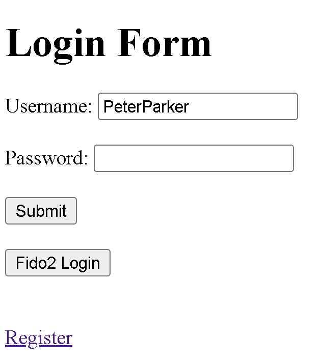
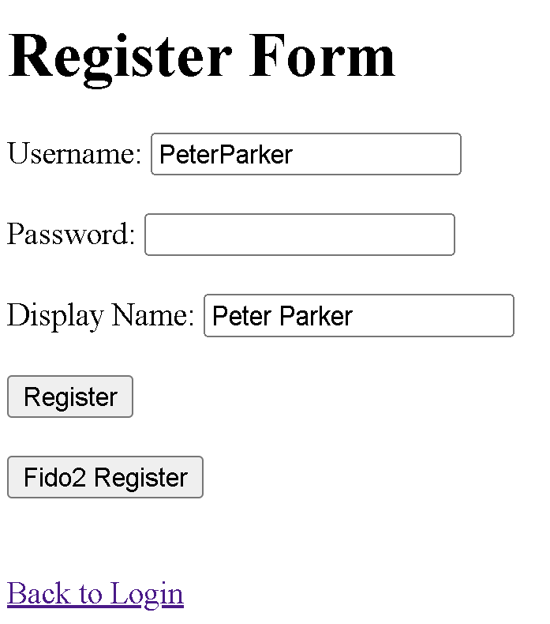

# Intro
The purpose of this very simple web server is to demonstrate how Fido2 authentication works (in comparison with password authentication.)
The web server uses Deno and Sqlite, and has minimal server functionallity beyond just registering users and logging in. 
It uses the **Fido2-Lib** library imported from Deno. 

# Setup
To begin, create a .PNG image file and name it "Service.png" and place in the /Box folder. This will be the image that is served upon login. 
(Optionally, you can create a favicon.ico file in the root directory, which is also served by the web server.)
Then, create the Sqlite database. 
```
deno run .\db_stuff.ts
```
 
Then, create the other tables mentioned in db_stuff2.ts, db_stuff3.ts, and DB_Queries.txt.
The **people** table governs user IDs, usernames, display names, and password hashes. The **credentials** table contains Fido2 credentials.
The **cookies** table contains the session cookies which proves that a user is authorized to access /Box/Service.png. Cookies are served to the user upon a successful login.
The **sessionChallenges** table has challenges that are stored by the server during Fido2 credential creation 
(Note these are not the challenges stored during Fido2 login, which are stored in server memory in a map (challengeMap of type Map<string,string>)). 

# Using the Server
You register accounts with the register.html page (and can register Fido2 credentials), then login with the login form (basic.html).
You can register and login with Fido2 / passkeys, or just a simple password.
Upon login, the web server should redirect you to /Box/Service.png

The web server should run on **localhost port 8000**

Running the server:
```
deno run --allow-net --allow-read --allow-write server.ts
```

# What it looks like



